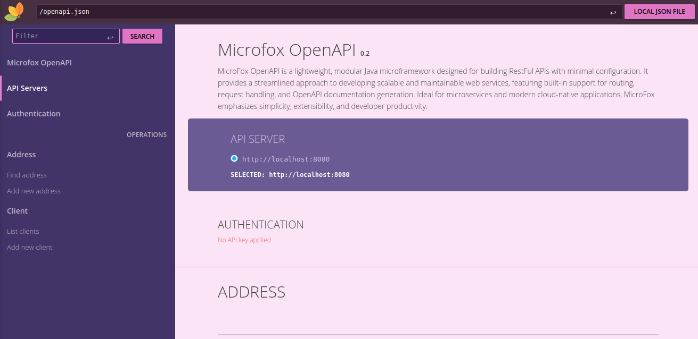

<p align="center">
  
</p>

# MicroFox

MicroFox is a lightweight, developer-friendly **framework** designed to simplify the setup and management of
microservice-based projects.    
With a focus on ease of use and minimal configuration, MicroFox helps teams get started quickly, offering a smooth path
from development to deployment.    
Whether you're building a small service or scaling up a complex system, MicroFox keeps things simple and efficient.

### Example Project Setup :

```xml
<?xml version="1.0" encoding="UTF-8"?>
<project xmlns:xsi="http://www.w3.org/2001/XMLSchema-instance"
         xmlns="http://maven.apache.org/POM/4.0.0"
         xsi:schemaLocation="http://maven.apache.org/POM/4.0.0 http://maven.apache.org/xsd/maven-4.0.0.xsd">
    
    <modelVersion>4.0.0</modelVersion>
    <groupId>org.example</groupId>
    <artifactId>Training</artifactId>
    <version>1.0-SNAPSHOT</version>

    <parent>
        <groupId>ir.moke.microfox</groupId>
        <artifactId>microfox-parent</artifactId>
        <version>0.6.3</version>
    </parent>

    <dependencies>
        <dependency>
            <groupId>ir.moke.microfox</groupId>
            <artifactId>microfox-http</artifactId>
        </dependency>
        <dependency>
            <groupId>ir.moke.microfox</groupId>
            <artifactId>microfox-job</artifactId>
        </dependency>
        
        <!-- Base on you project can add other implementations by microfox -->
    </dependencies>
</project>

```

### Simple Usage :

```java
import static ir.moke.microfox.MicroFox.*;

public class MicroFoxTest {
    
    public static void main(String[] args) {

        /* Easy Implement Rest API */
        httpRouter("/book/add",Method.GET, ((request, response) -> {/*...*/}));

        /* Easy setup job */
        job(EchoJob.class, "*/3 * * * * ? *");
    }
}
```
---
### [Wiki page for more information](https://github.com/microfox-framework/MicroFox/wiki)   

---
### Example Project:

https://github.com/microfox-framework/Microfox-Example

<p align="center">
  
</p>